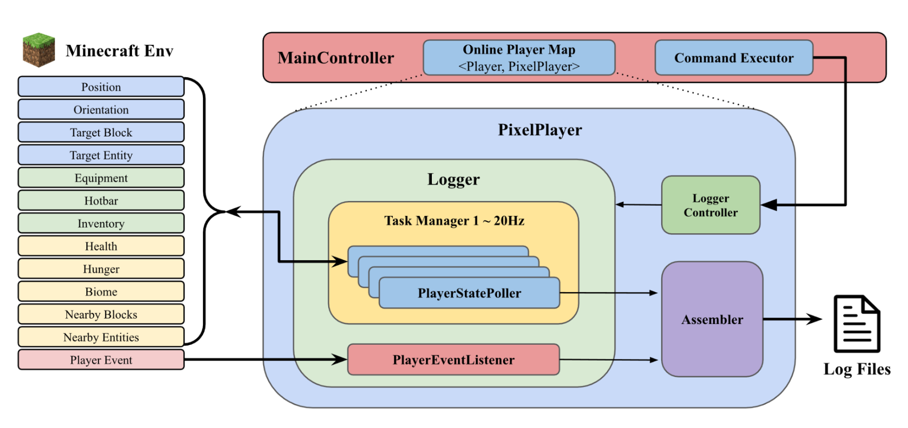

# Summary

Traditional cognitive assessments often rely on isolated, output-focused measurements that may fail to capture the complexity of human cognition in naturalistic settings. We present **pixelLOG**, a high-performance data collection framework for Spigot-based Minecraft servers designed specifically for process-based cognitive research. Unlike existing frameworks tailored only for artificial intelligence agents, pixelLOG also enables human behavioral tracking in multiplayer/multiagent environments. Operating at configurable frequencies up to and exceeding 20 updates per second, the system captures comprehensive behavioral data through a hybrid approach of active state polling and passive event monitoring. By leveraging Spigot’s extensible API, pixelLOG facilitates robust session isolation and produces structured JSON outputs integrable with standard analytical pipelines. This framework bridges the gap between decontextualized laboratory assessments and richer, more ecologically valid tasks, enabling high-resolution analysis of cognitive processes as they unfold in complex, virtual environments.

# Statement of need

Cognitive assessment methodologies have historically been constrained by laboratory-like conditions and narrowly defined tasks. These assessments often emphasize the measurement of singular executive functions (e.g., working memory) through static, output-based metrics (e.g., average number of arbitrary items recalled) [@Miyake:2000]. While foundational, these conventional approaches frequently lack ecological validity [@Hedge:2018], failing to capture the adaptive nature of human cognitive processes in multifaceted, socially dynamic, real-world environments. Recent evidence suggests that many established tasks may primarily measure information uptake speed rather than distinct cognitive constructs [@Loeffler:2024], limiting our ability to observe how individuals integrate strategies and respond dynamically to changing scenarios.

In response, the field is shifting towards assessment frameworks that provide process-oriented, fine-grained behavioral data. Minecraft—an open-ended sandbox environment—has emerged as a powerful platform for simulating complex tasks requiring navigation, resource management, and problem-solving. However, a critical gap exists in the tooling available for this platform. To date, technical frameworks for Minecraft have been dominated by reinforcement learning (RL) research. Prominent tools such as Microsoft's Project Malmo [@Perez:2019] and MineDojo [@Fan:2022] provide standardized interfaces for agent training and observation [@Wang:2023; @Qin:2024]. While effective for algorithmic agents, there is a lack of specialized infrastructure for human cognitive research that requires high-frequency, reliable, and unobtrusive data logging in multiplayer contexts.

We introduce pixelLOG (Logging of Online Gameplay) to address this need. pixelLOG is a plugin-based logging framework integrating with the Spigot modification layer. It enables fine-grained data acquisition at frequencies exceeding 20 Hz, capturing both continuous states (e.g., player avatar location, gaze direction) and discrete events (e.g., environment interaction). This architecture supports the precise mapping of individual cognitive trajectories onto environmental cues, facilitating a process-based examination of how individuals engage with complex tasks.

# Software design

pixelLOG is designed as a modular, extensible framework operating within the Spigot Minecraft server environment (compatible with version 1.20.4 and adaptable to others). As shown in Figure 1, the system architecture comprises distinct layers for player management, data acquisition, and structured output generation.

## Scalable Multi-Player Data Management

To support concurrent data collection, pixelLOG utilizes a hierarchical architecture centered on a `MainController`. Upon a player's connection, the system instantiates a dedicated `PixelPlayer` object that encapsulates all participant-specific data collection processes. This isolation is critical for data integrity.

Early iterations utilizing centralized logging revealed bottlenecks under high load. Our implementation uses distributed, thread-safe queues for individual players. This ensures that the high-frequency data streams of one participant do not interfere with the collection stability of others, maintaining linear scalability with increasing player counts.

## Adaptive Temporal Resolution (Hybrid Data Capture)

pixelLOG employs a hybrid data collection strategy to capture the full spectrum of cognitive behavior:

1.  **Active State Polling (Continuous):** A `Logger` component coordinates `PlayerStatePollers` that operate at configurable frequencies (e.g., 20 Hz). These tasks capture rapidly evolving attributes such as player avatar position (x,y,z), velocity, and view orientation (pitch, yaw). Lower-frequency pollers simultaneously survey static environmental parameters, such as biome types or nearby entities, optimizing computational overhead.
2.  **Event-Driven Monitoring (Discrete):** To capture episodic markers, the system implements `PlayerEventListeners`. These intercept specific game events via the Spigot event system, such as block interactions, inventory changes, or combat.

By fusing asynchronous event data with continuous polling trajectories, researchers can anchor moment-to-moment behavioral patterns within the context of meaningful actions.

## Structured Data Integration

An `Assembler` component harmonizes the heterogeneous data streams into chronologically ordered, structured JSON output. This format was selected for its compatibility with standard data science toolchains (e.g., Python pandas, R). The output structure hierarchically organizes session metadata, high-frequency state logs, and discrete event logs, enabling straightforward ingestion for subsequent statistical modeling or machine learning analysis.

# Research impact statement

This utility has been demonstrated in recent applications: the framework served as the data collection backbone for *pixelDOPA (Digital Online Psychometric Assessment)*, enabling the validation of immersive cognitive minigames against the NIH Toolbox [@Marticorena:Immersive:2025], and supported real-time data integration for *AMLEC*, a multidimensional Bayesian active machine learning study of working memory [@Marticorena:Multidimensional:2025].

# References